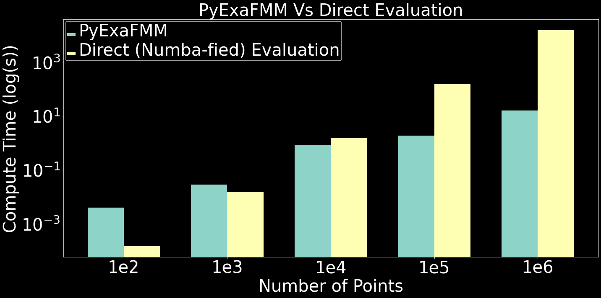

<h1 align='center'>
PyExaFMM
</h1>

[](https://anaconda.org/skailasa/pyexafmm) [](https://anaconda.org/skailasa/pyexafmm) [](https://anaconda.org/skailasa/pyexafmm)

PyExaFMM is an adaptive particle kernel-independent FMM based on [1], written in pure Python with some extensions. Representing a compromise between portability, ease of use, and performance. Optimisations are currently implemented  using Numba, Numpy, and CUDA acceleration.

The goal of PyExaFMM is to develop a highly performant implementation of the adaptive particle FMM written in Python, as the utility of FMM algorithms are hindered by their relatively complex implementation, especially for achieving high-performance.

## Performance

PyExaFMM compares favourably on realistic problem sizes with naive direct evaluation with a numba-fied kernel. The figure below provides a benchmark for the Laplace kernel evaluated on uniformly distributed points.




Here we use an order 5 multipole expansion, an order 6 local expansion, and constrain leaf nodes to contain a maximum of 100 particles. The target rank in our M2L operator compression is kept at 1. The benchmark was run on an Intel i7-9750H processor.

## System Requirements

An NVidia GPU is required, as PyExaFMM is accellerated with CUDA.

## Install

Download from Anaconda cloud into a conda/mini-conda environment:

```bash
conda install -c skailasa pyexafmm
```

Developers may want to build from source:

```bash
# Add required channels
conda config --env --add channels skailasa
conda config --env --add channels conda-forge
conda config --env --add channels anaconda
conda config --env --add channels nvidia

# Clone
git clone git@github.com:exafmm/pyexafmm.git
cd pyexafmm

# Build
conda build conda.recipe

# Install
conda install --use-local pyexafmm

# Editable mode for live development
python setup.py develop
```

## Configure

After installation, you must precompute and cache the FMM operators for your dataset. Most of these are calculated using the techniques in [1], notably M2M and L2L matrices can be computed for a single parent node and its children, and scaled in a simple fashion for the kernels implemented by PyExaFMM. For the M2L operators, we introduce a randomised SVD compression [2], to avoid storing and applying potentially very large dense matrices.

This is done via a `config.json` file, PyExaFMM will look for this in your **current working directory**, which allows you to configure experimental parameters, as well as choose a kernel, and computational backend, which optimise the operator methods of the FMM using different approaches.

```json
{
    "experiment": "fmm",
    "npoints": 100000,
    "data_type": "random",
    "order_equivalent": 5,
    "order_check": 6,
    "kernel": "laplace",
    "backend": "numba",
    "alpha_inner": 1.05,
    "alpha_outer": 2.95,
    "max_level": 10,
    "max_points": 100,
    "target_rank": 1,
    "cond": 1e-16
}
```

|Parameter      | Description                                        |
|--------------	|-----------------------------------------------	 |
| `experiment`	| Experiment name, used to label HDF5 database          |
| `npoints`     | Number of points to generate in test data.         |
| `data_type`   | Type of test data to generate.                     |
| `order_equivalent`| Order of multipole expansions, same as discretisation of equivalent surface.  |
| `order_check`     | Order of local expansions, same as discretisation of check surface.           |
| `kernel`      | Kernel function to use, currently only supports laplace.          |
| `backend`      | Compute backend to use, currently only supports numba.           |
| `alpha_inner`	| Relative size of inner surface's radius.           |
| `alpha_outer`	| Relative size of outer surface's radius.           |
| `max_level`   | Depth of octree to use in simulations.             |
| `target_rank` | Target rank in low-rank compression of M2L matrix. |
| `cond` | Threshold under which to ignore singular values in randomised SVD. |

PyExaFMM provides some simple test-data generation functions, which can be configured for. However, to use your own data, simply create a HDF5 file, with the same name as `experiment` in your configuration file, with the following group hierarchy,

```bash
particle_data/
    |_ sources/
    |_ source_densities/
    |_ targets/
```

where `sources` and `targets` are the coordinates of your source and target particles respectivley, of shape `(nsources/ntargets, 3)`, and source densities is of shape `(nsources, 1)`.

The CLI workflow is as follows,

```bash

# Generate test data (optional)
fmm generate-test-data

# Run operator pre-computations
fmm compute-operators
```

Once this is done, you'll be left with a `.hdf5` database of precomputed parametrisations, with the same name as your specified `experiment` parameter from your `config.json`. If you've used your own data, then the operator precomputations will be written into the same HDF5 file.

Finally, ensure that the following MKL environment variables are set,

```bash
export MKL_THREADING_LAYER=tbb
export MKL_NUM_THREADS=1
```

This is to ensure that there is no over-subscription of threads from calling BLAS routines on top of Numba. See [this discussion](https://github.com/numba/numba/issues/6637#issuecomment-760460620) for more information. TBB should be installed alongside Numba, however if this isn't the case, it can be installed separately,

```bash
conda install -c conda-forge tbb
```

 Now you are ready to start programming with PyExaFMM.


## Usage

Example usage of the API presented by the `Fmm` class is as follows:

```python
from fmm import Fmm

# Instantiate an experiment through an FMM object, with default 'config.json'
e = Fmm()

# Optionally specify non-default config filename, e.g. 'test_config.json'
# e = Fmm('test_config')

# Run FMM algorithm
e.run()

# Access target potentials at each node via an index pointer
# Find index of a given node in the complete octree
key = e.complete[42]
idx = e.key_to_index[key]
e.target_potentials[e.target_index_pointer[idx]:e.target_index_pointer[idx+1]]

## These correspond to the the similarly indexed targets
e.targets[e.target_index_pointer[idx]:e.target_index_pointer[idx+1]]
```


## CLI

```bash
fmm [OPTIONS] COMMAND [ARGS]
```

|Command               | Action                                  | Options                 |
|--------------        |------------------------------------	 |--------------           |
| `compute-operators`  | Run operator pre-computations           | `-c <config_filename>`  |
| `generate-test-data` | Generate `npoints` sources & targets    | `-c <config_filename>`  |

The option to specify a custom config filename `-c` overrides the PyExaFMM default to search for a file named `config.json` in your current working directory to parameterise precomputations.


## References

[1] Ying, L., Biros, G., & Zorin, D. (2004). A kernel-independent adaptive fast multipole algorithm in two and three dimensions. Journal of Computational Physics, 196(2), 591-626.

[2] Halko, N., Martinsson, P. G., & Tropp, J. A. (2011). Finding structure with randomness: Probabilistic algorithms for constructing approximate matrix decompositions. SIAM review, 53(2), 217-288.
